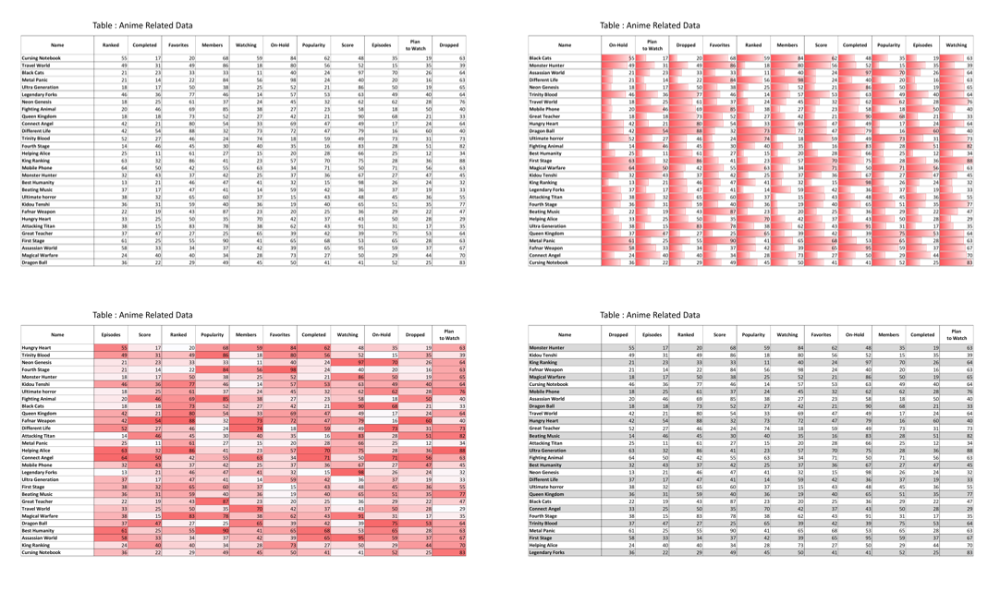

# Numeric Data Table Visual Aid Experiment

## Overview

This research experiemnt explores the effectiveness of using visual aids to understand  numeric data tables.

## Generated Data Tables

### Tasks

**Filter**: In the X column, count how many entries exceed the value of.

**Correlate** :Determine which column amongst X, Y, and Z is positively correlated with Column A.**

**Sort**:In the X column, name the animes with the highest five values in ascending order.

**Calculate Derived Value**: In the X column, calculate a rough estimate of the average value

**Retrieve Value**:In the X column, find the anime with a value equal to Y

### Dependencies\How to Run

- Python: Python 3.x is required.
- Libraries: Tkinter for the GUI, PIL for image handling, and pyautogui for automating GUI interactions.
