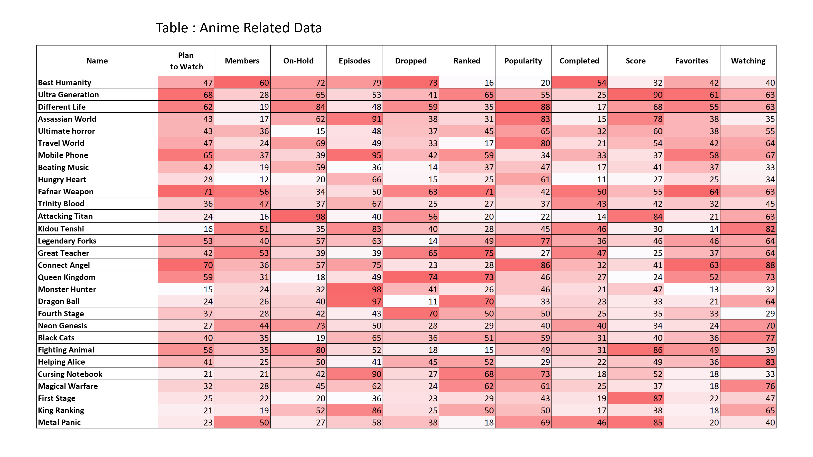
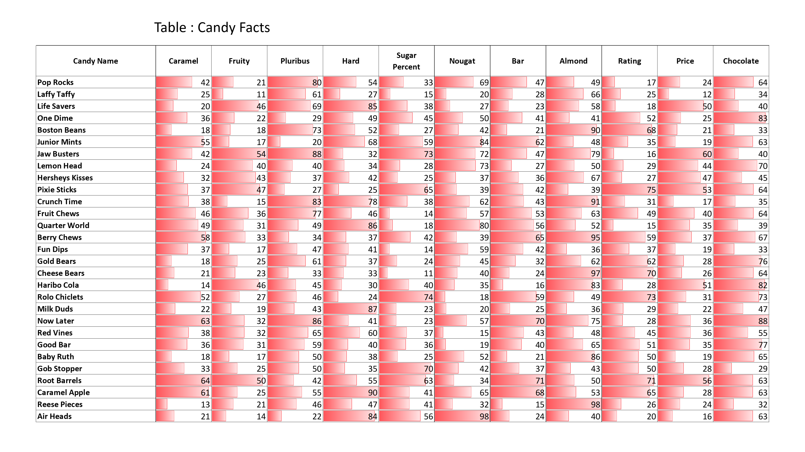
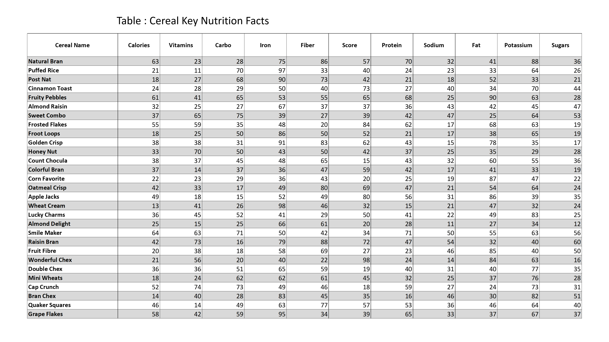
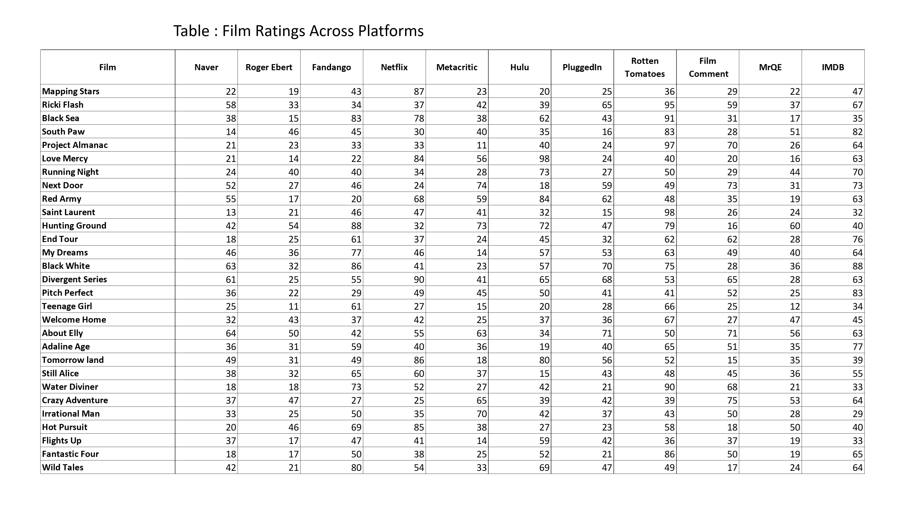

# Numeric Data Table Visual Aid Experiment

## Overview
This research experiemnt explores the effectiveness of using visual aids to understand  numeric data tables.

## Generated Data Tables: 









## Shortlisted Data Table Tasks:

From the list of tasks that were shortlisted and the table generating process that was covered last week. Here is a demo to figure all the tasks to help narrow down and finalize the experiment.

- Full document can be found here: 
[Click here to view full list](./ShortListed_Tasks.md)

### Task 1: Filter
- **In the Members column, count how many entries exceed the value of 38**

### Task 2: Correlate
- **Determine which column amongst X, Y, and Z is positively correlated with Column A.**

### Task 3: Sort
- **In the Members column, name the animes with the highest five values in ascending order.**

### Task 4: Calculate Derived Value
- **In the Members column, calculate a rough estimate of the average value**

### Task 5: Retrieve Value
- **In the Members column, find the anime with a value equal to 31**

## Running the Experiment

### Important Files and Folders
- [test.py](./start_experiment.py): Main file for Running the experiment
- [EyeTrackerHandler.py](./EyeTrackerHandler.py): supporting class incharge of eye Tracker
- [Results](./Experiment_Results/): input file and results of each participant 
- [Exeriment_Data](./Experiment_Data/):Find Tables used int the experiment


### Dependencies\How to Run:
- Python: Python 3.x is required.
- Libraries: Tkinter for the GUI, PIL for image handling, and pyautogui for automating GUI interactions.
- Running: Execute the script in a Python environment. Ensure all dependent libraries are installed.

```bash
python -m venv myenv   
myenv\Scripts\Activate.ps1

pip install pillow
pip install pyautogui

python test.py
Enter participant's ID number: 1